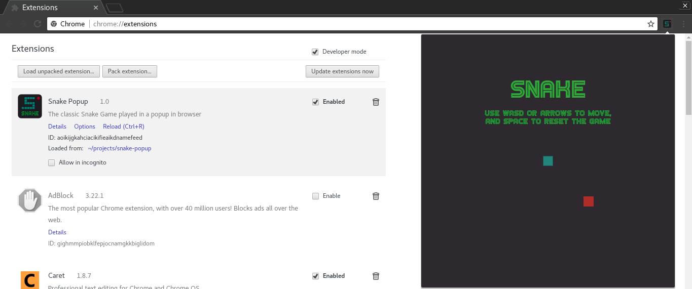
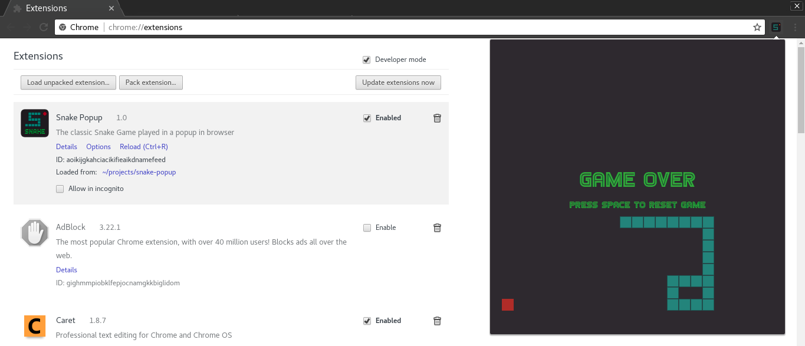

# Snake Popup
A Google Chrome extension that provides the classic Snake Game in a popup window in your browser.

## Description
Play the classic Snake Game from any tab in your browser with this simple extension. You can customize colors, sizes, the game difficulty to play the game asexactly as you want!

## Examples
Easily customize game settings by editing the options page!

Enjoy Snake in a popup by using WASD or the arrow keys!

## Technologies Used:
- Javascript (with ES5\ES6 features)
- HTML & CSS
- Chrome Storage API
- jQuery
- jQuery Alertigo Plugin (can be found [here](https://github.com/TetrisSmalls/Alertigo))

## Install

### Unpacked Extension
* Download the code, unzip
* Open (chrome://extensions/) or select the menu 'More Tools > Extensions.'
* Enable developer mode at top right.
* Click 'Load unpacked extension...' and select the unzipped folder.
* Click the Snake Icon in the corner and play!

